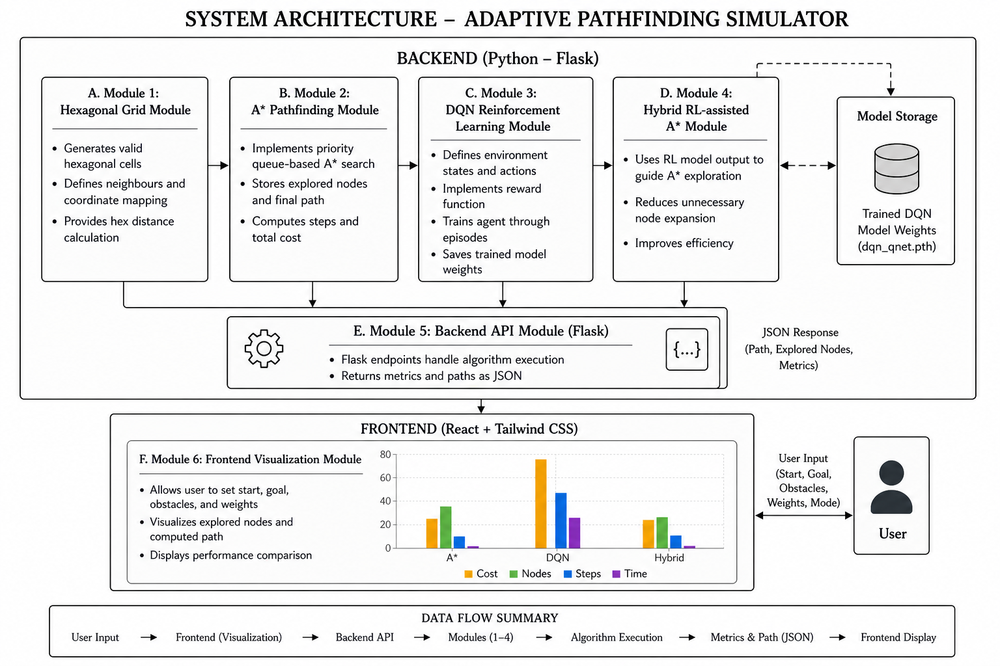
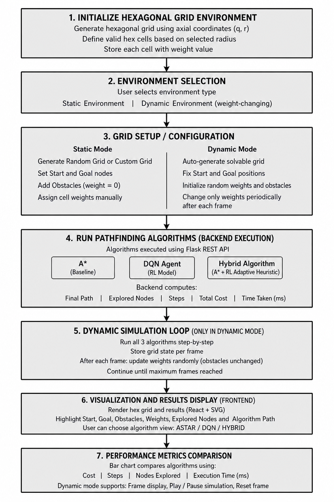

# Adaptive Pathfinding on Hexagonal Grids using Hybrid A*

> **Saqib Ahmed K & Mohammed Umar** — School of CSE, REVA University, Bengaluru, India

---

## Abstract

Route computation in dynamic, obstacle-laden environments represents a core challenge in Artificial Intelligence research, with broad applications spanning robotics, self-driving systems, warehouse automation, and game-based simulations. While deterministic algorithms like A* yield provably optimal trajectories in well-defined static settings, their scalability suffers considerably when confronted with large-scale or frequently changing environments, owing to exhaustive node expansion. Although Reinforcement Learning (RL) — especially Deep Q-Network (DQN) architectures — introduces the capacity to acquire navigation policies through environmental feedback, such approaches demand intensive training cycles and yield no formal path-quality guarantees.

This work introduces a three-pronged navigation framework evaluated on hexagonal grid topologies: a classical A* planner, a DQN-driven autonomous agent, and a novel Hybrid architecture in which the trained RL policy modulates the A* heuristic function. The resulting system reduces redundant search effort while preserving solution quality close to the A* optimum. A full-stack simulation platform was constructed using a Python Flask server for computational logic and a React/Tailwind CSS interface for interactive visualization, with performance benchmarked across execution latency, path cost, node expansion count, and traversal steps.

**Keywords:** Route Planning, A* Search, Deep Reinforcement Learning, DQN, Hybrid Navigation, Hex Grid, Intelligent Traversal

---

## System Architecture



The platform is built with a clean separation of concerns across two layers:

| Layer | Technology | Responsibility |
|---|---|---|
| **Computation** | Python · Flask · PyTorch | Algorithm execution, DQN inference, REST API |
| **Presentation** | React 18 · Tailwind CSS · Vite | Hex grid rendering, interactive controls, metrics charts |
| **Data Exchange** | JSON over HTTP | Paths, expanded nodes, cost, timing |

### Backend Modules

| Module | Description |
|---|---|
| `hex_grid.py` | Axial coordinate encoding, adjacency, admissible hex-distance heuristic |
| `astar.py` | Priority-queue A* search adapted for hexagonal topology |
| `rl_env.py` | MDP environment — state space, reward function, episode management |
| `rl_agent.py` | DQN inference engine; restores weights from saved checkpoint |
| `hybrid.py` | Injects DQN action-value scores into A* node-evaluation pipeline |
| `dynamic_grid.py` | Time-varying grid with periodically shifting traversal costs |
| `dynamic_runner.py` | Drives simulation cycles across successive grid snapshots |
| `app.py` | Flask REST API — dispatches algorithm runs, serialises results |

### Frontend Components

| Component | Description |
|---|---|
| `HexGrid.jsx` | Interactive canvas for hex grid rendering and cell selection |
| `ControlPanel.jsx` | Controls for start/goal, obstacle marking, terrain weights |
| `MetricsChart.jsx` | Side-by-side performance visualisation across algorithms |
| `api.js` | Axios-based service layer for backend communication |

---

## Workflow



The three algorithms are evaluated across four experimental conditions:

1. **Static environment** — fixed obstacles, uniform terrain
2. **Weighted terrain** — heterogeneous tile traversal costs
3. **Dynamic environment** — periodically shifting traversal costs
4. **Dense/maze-like** — high-density obstacle configurations

### Algorithm Strategies

```
Classical A*
  └─ Min-heap on f(n) = g(n) + h(n)
  └─ Admissible hex-distance heuristic
  └─ Guarantees optimal path cost

DQN Agent
  └─ 6-directional action space on hex grid
  └─ Reward: goal bonus / obstacle penalty / step cost
  └─ Trained network saved to models/dqn_qnet.pth

Hybrid RL-guided A*
  └─ Queries DQN action-values at each expansion step
  └─ Biases node priority toward RL-promising directions
  └─ Preserves A* optimality while cutting node expansions
```

### Key Findings

- **A\*** delivers minimum-cost trajectories; node expansion grows steeply with grid complexity.
- **DQN** adapts well to unseen configurations but has training overhead and no optimality guarantees.
- **Hybrid** achieves the best trade-off — substantially fewer node expansions and lower latency while staying close to A* path quality. Gains are most pronounced in weighted-terrain and maze-like scenarios.

---

## Tech Stack

**Backend**
- Python 3.11
- Flask 3.0.2 · flask-cors 4.0.0
- PyTorch 2.2.0
- NumPy 1.26.4 · SciPy 1.12.0
- Gymnasium 0.29.1

**Frontend**
- React 18 · React DOM
- Vite 8 · Tailwind CSS 3
- Chart.js · Recharts · Axios

---

## Getting Started

### Backend

```bash
cd "source cose/backend"
pip install -r requirements.txt
python app.py
```

The Flask server starts on `http://localhost:5000`.

### Frontend

```bash
cd "source cose/frontend"
npm install
npm run dev
```

The Vite dev server starts on `http://localhost:5173`.

---


## License

See [LICENSE](LICENSE) for details.
